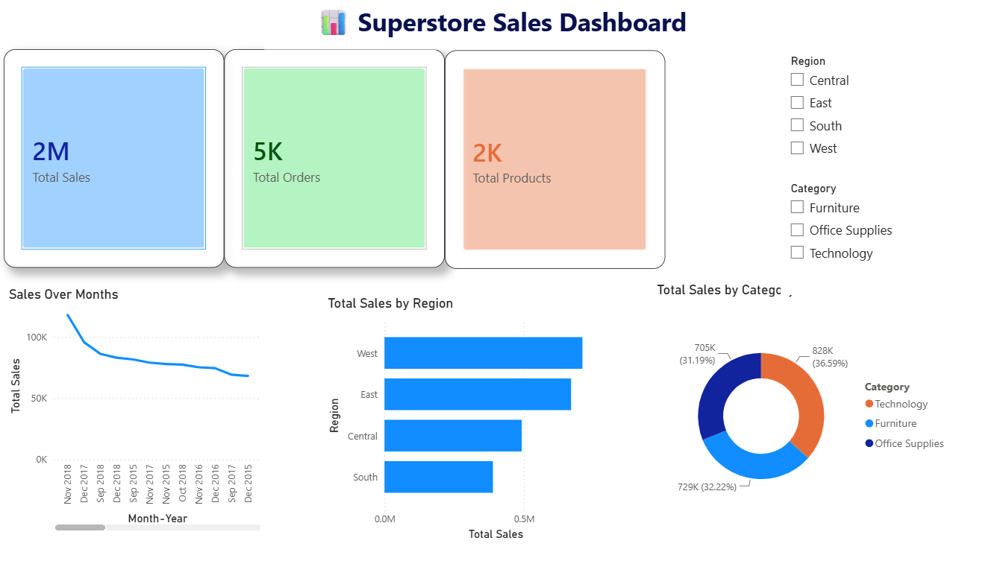

# 📊 Superstore Sales Dashboard | Power BI

## 📌 Project Overview
This project is an interactive Sales Dashboard developed using Microsoft Power BI. It analyzes Superstore sales data and provides valuable business insights through KPIs, charts, and interactive filters.

---

## 🚀 Dashboard Features
- 📈 Total Sales KPI
- 📦 Total Orders KPI
- 🛍️ Total Products KPI
- 📅 Monthly Sales Trend Analysis
- 🌍 Sales by Region
- 🛒 Sales by Category
- 🎛️ Interactive Slicers (Region & Category)

---

## 🛠️ Tools & Technologies
- Microsoft Power BI
- DAX
- Data Visualization
- Data Cleaning
- Business Intelligence

---

## 📊 Dashboard Preview

---

## 📈 Key Insights
- The West region recorded the highest total sales.
- Technology generated the highest share of total sales.
- Sales varied across different months, indicating changing business performance over time.

---

## 📂 Project Files

- `Task-8-Sales_Dashboard.pbix`
- `Dashboard.png`
- `Insights.txt`
- `README.md`

---

## 🎯 Skills Demonstrated
- Power BI Dashboard Development
- KPI Design
- DAX Measures
- Interactive Reporting
- Data Analysis
- Business Intelligence
- Data Visualization

---

## 👩‍💻 Author

**Kapa Sri Lakshmi**

Aspiring Data Analyst

GitHub: https://github.com/kapasrilakshmi075
